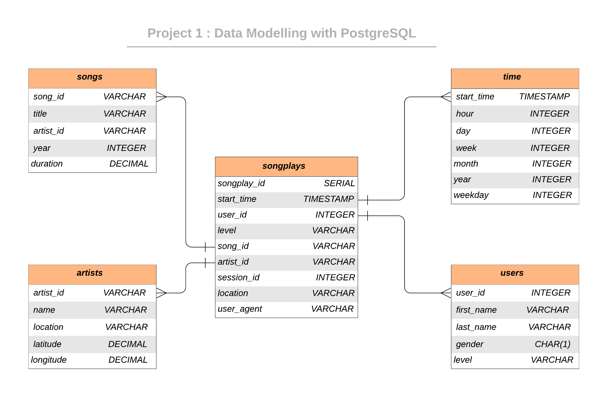

<br/>
 <h3 align="center">PostgreSQL - Data Modeling </h3>
 <p align="center">
  Udacity Nanodegree Course - Project 1
  <br />
  <br />

## About The Project
All four projects we will work with same dataset which is data of company named Sparkify. They have log files and song info files.

This project, they'd like a data engineer to create a Postgres database with tables designed to optimize queries on song play analysis. The role of this project is to create a database schema and ETL pipeline for this analysis. 

### Dataset
#### Song Dataset
Each file in the dataset is in JSON format and contains meta-data about a song and the artist of that song. 

Sample Record :
```
{"num_songs": 1, "artist_id": "ARJIE2Y1187B994AB7", "artist_latitude": null, "artist_longitude": null, "artist_location": "", "artist_name": "Line Renaud", "song_id": "SOUPIRU12A6D4FA1E1", "title": "Der Kleine Dompfaff", "duration": 152.92036, "year": 0}
```

#### Log Dataset
These log files in JSON format simulate activity logs from a music streaming application based on specified configurations.

Sample Record :
```
{"artist": null, "auth": "Logged In", "firstName": "Walter", "gender": "M", "itemInSession": 0, "lastName": "Frye", "length": null, "level": "free", "location": "San Francisco-Oakland-Hayward, CA", "method": "GET","page": "Home", "registration": 1540919166796.0, "sessionId": 38, "song": null, "status": 200, "ts": 1541105830796, "userAgent": "\"Mozilla\/5.0 (Macintosh; Intel Mac OS X 10_9_4) AppleWebKit\/537.36 (KHTML, like Gecko) Chrome\/36.0.1985.143 Safari\/537.36\"", "userId": "39"}
```


## Database Schema Design

### Data Model ERD



## Project structure

Files in this repository:

|  File / Folder   |                         Description                          |
| :--------------: | :----------------------------------------------------------: |
|       data       | Folder at the root of the project, where all song and log data JSONS reside |
|  sql_queries.py  |      Contains the SQL queries for data modeling and ETL      |
| create_tables.py |         Drops and creates tables. (Reset the tables)         |
|    test.ipynb    |                Test and Exploring the database tables                 |
|      etl.py      | Processes all files from song_data and log_data and loads them into  tables |
|      README      |                         Readme file                          |


<!-- GETTING STARTED -->

## Getting Started

### How to run

Follow the steps to extract and load the data into the data model.

1. Clone source code and navigate to project folder

2. Run `create_tables.py` to create/reset the tables by

3. Run ETL process and load data into database by  running `elt.py`

4. Test the data has been loaded into database by executing queries in `test.ipynb`
    
### Songlay Analysis:

Q1: Top most artist name:

select a.name as artist_name, count(*) from songplays s join artists a on s.artist_id=a.artist_id  group by a.name order by count(*) desc limit 1;

```
 artist_name | count 
-------------+-------
 Elena       |     1
```

Q2: Sex ratio on app:

select u.gender,count(s.*) from songplays s join users u on s.user_id=u.user_id group by u.gender; 

```
 gender | count 
--------+-------
 M      | 25928
 F      | 71980
```

Q3: How many paid users in app:

select count(*) from songplays where level='paid'  group by level; 
```
paid_users_cnt 
-------
  5933
```

Q4: location of app users:

select location,count(*) from songplays where level='paid'  group by location; 
```
                location                 | count 
-----------------------------------------+-------
 San Jose-Sunnyvale-Santa Clara, CA      |   196
 Chicago-Naperville-Elgin, IL-IN-WI      |   462
 Sacramento--Roseville--Arden-Arcade, CA |   253
 Birmingham-Hoover, AL                   |   267
 Longview, TX                            |    17
 Janesville-Beloit, WI                   |   288
 Atlanta-Sandy Springs-Roswell, GA       |   428
 Waterloo-Cedar Falls, IA                |   433
 Lake Havasu City-Kingman, AZ            |   336
 San Antonio-New Braunfels, TX           |    33
 Winston-Salem, NC                       |   213
 Lansing-East Lansing, MI                |   557
 Tampa-St. Petersburg-Clearwater, FL     |   307
 Marinette, WI-MI                        |   169
 New York-Newark-Jersey City, NY-NJ-PA   |   149
 Augusta-Richmond County, GA-SC          |   140
 Portland-South Portland, ME             |   648
 Detroit-Warren-Dearborn, MI             |    72
 Red Bluff, CA                           |   205
 San Francisco-Oakland-Hayward, CA       |   760
```
