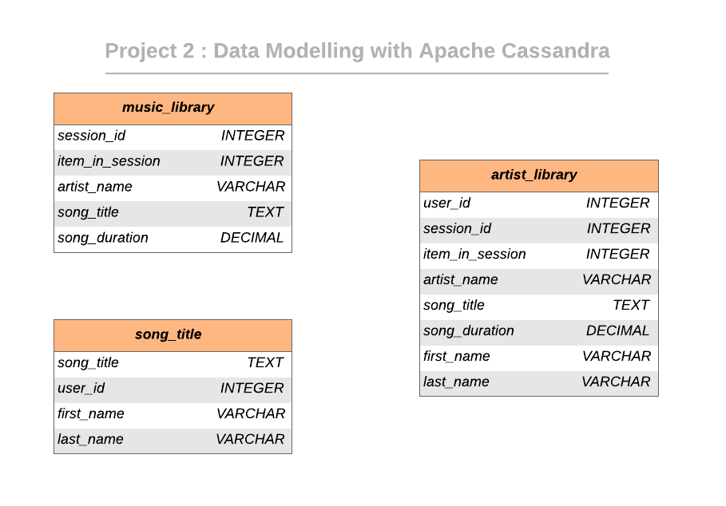

<br/>
 <h3 align="center">Data Modeling ETL with Apache Cassandra</h3>
 <p align="center">
  Udacity Nanodegree Course Project 2
  <br />
  <br />
  <br />
 </p>


## About The Project


It needs data engineer to create an Apache Cassandra database which can create queries on song play data to answer the questions and make meaningful insights. 

### Project Description

In this project, we will model the data with Apache Cassandra and build an ETL pipeline using Python. 

### Dataset

#### Event Dataset


List of available data columns :

```
artist, auth, firstName, gender, itemInSession, lastName, length, level, location, method, page, registration, sessionId, song, status, ts, userId
```


## Keyspace Schema Design

### Data Model ERD

The keyspace design is shown in the image below. 



## Project structure

Files in this repository:

|     File / Folder      |                         Description                          |
| :--------------------: | :----------------------------------------------------------: |
|       event_data       | Folder at the root of the project, where all user activity CSVs reside |
|         images         |  Folder at the root of the project, where images are stored  |
|    elt.ipynb     | iPython notebook containing the ETL pipeline including data extraction, modeling and loading into the keyspace tables. |
|         README         |                         Readme file                          |


<!-- GETTING STARTED -->

## Getting Started
### How to run

Follow the steps to extract and load the data into the data model.

1. Navigate to project folder
2. Run `etl.ipynb` iPython notebook
3. Program will create `event_datafile_new.csv`  and init the ETL process and load data into tables 
