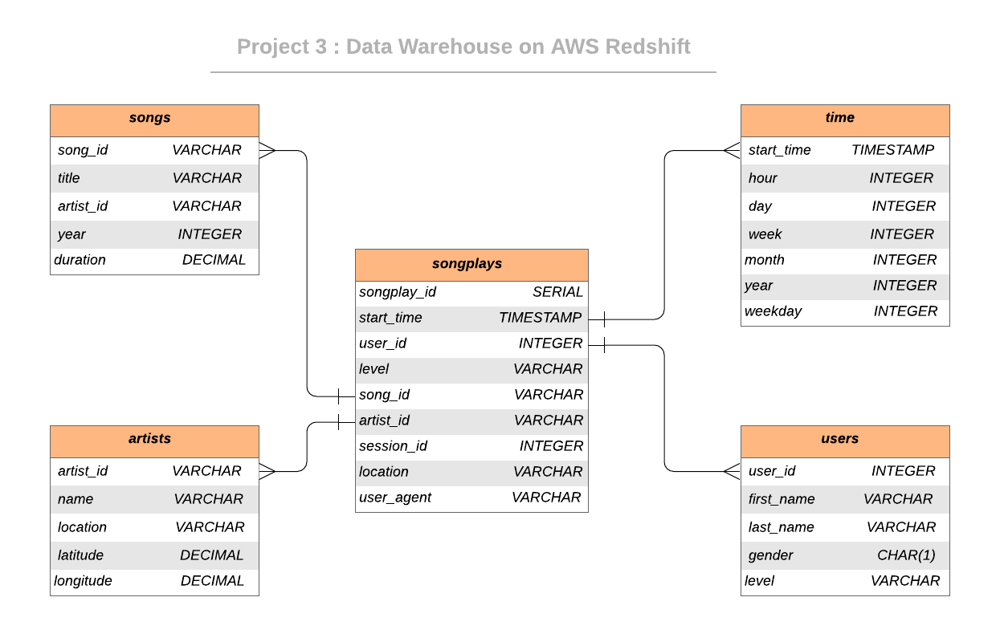

<br/>
 <h3 align="center">Data Warehouses with AWS Redshift</h3>
 <p align="center">
  Udacity Nanodegree Course Project 3
  <br />


## About The Project

The role of this project is to create a data warehouse on cloud (AWS Redshift) and build ETL pipeline for this analysis. 


### Dataset

#### Song Dataset
Sample Record :

```
{"num_songs": 1, "artist_id": "ARJIE2Y1187B994AB7", "artist_latitude": null, "artist_longitude": null, "artist_location": "", "artist_name": "Line Renaud", "song_id": "SOUPIRU12A6D4FA1E1", "title": "Der Kleine Dompfaff", "duration": 152.92036, "year": 0}
```

#### Log Dataset


Sample Record :

```
{"artist": null, "auth": "Logged In", "firstName": "Walter", "gender": "M", "itemInSession": 0, "lastName": "Frye", "length": null, "level": "free", "location": "San Francisco-Oakland-Hayward, CA", "method": "GET","page": "Home", "registration": 1540919166796.0, "sessionId": 38, "song": null, "status": 200, "ts": 1541105830796, "userAgent": "\"Mozilla\/5.0 (Macintosh; Intel Mac OS X 10_9_4) AppleWebKit\/537.36 (KHTML, like Gecko) Chrome\/36.0.1985.143 Safari\/537.36\"", "userId": "39"}
```


## Database Schema Design

### Data Model ERD



## Project structure

Files in this repository:

|     File / Folder      |                         Description                          |
| :--------------------: | :----------------------------------------------------------: |
|     sql_queries.py     | Contains the SQL queries for staging, schema definition and ETL |
|    create_tables.py    | Drops and creates tables on AWS Redshift (Reset the tables)  |
|         etl.py         | Stages and transforms the data from S3 buckets and loads them into tables |
|         README         |                         Readme file                          |


## Getting Started
### How to run

1. Go to project folder

2. Edit the config file (AWS Access Key and Secret Key)

3. Create the clusters on AWS by

4. Create/Reset the tables by

5. Run ETL process and load data 
6. Validate the data
7. Finish by destroy the clusters on AWS by
