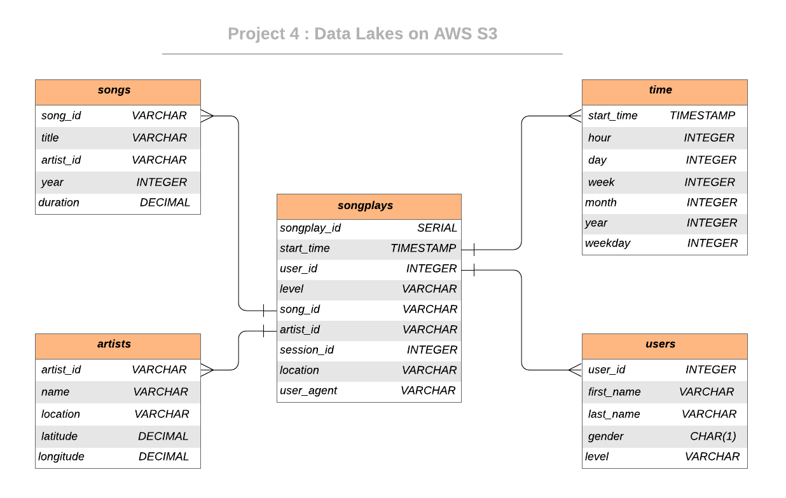

<br/>
 <h3 align="center">Data Lake with AWS S3</h3>
 <p align="center">
  Udacity Nanodegree - Project 4
  <br />
  
## About The Project


### Project Description

As a data engineer, you need to to build an ETL pipeline that extracts their data from S3,  processes them using Spark, and loads the data back into S3 as a set of fact and dimensional tables. The output will allow  analytics team to continue finding insights in what songs their users are listening to. 
The main role of this project is using AWS S3 to create a data lake on cloud and building ETL pipeline .

### Dataset

#### Song Dataset

Sample Record :

```
{"num_songs": 1, "artist_id": "ARJIE2Y1187B994AB7", "artist_latitude": null, "artist_longitude": null, "artist_location": "", "artist_name": "Line Renaud", "song_id": "SOUPIRU12A6D4FA1E1", "title": "Der Kleine Dompfaff", "duration": 152.92036, "year": 0}
```

#### Log Dataset
Sample Record :

```
{"artist": null, "auth": "Logged In", "firstName": "Walter", "gender": "M", "itemInSession": 0, "lastName": "Frye", "length": null, "level": "free", "location": "San Francisco-Oakland-Hayward, CA", "method": "GET","page": "Home", "registration": 1540919166796.0, "sessionId": 38, "song": null, "status": 200, "ts": 1541105830796, "userAgent": "\"Mozilla\/5.0 (Macintosh; Intel Mac OS X 10_9_4) AppleWebKit\/537.36 (KHTML, like Gecko) Chrome\/36.0.1985.143 Safari\/537.36\"", "userId": "39"}
```


## Database Schema Design

### Data Model ERD

An entity relationship diagram (ERD) of the data model is given below. 




## Project structure


| File / Folder |                         Description                          |
| :-----------: | :----------------------------------------------------------: |
|     data      | A smaller version of data are stored |
|    etl.py     | ETL to load from S3 and process and store back to S3		|
|    dl.cfg     |              Configuration file for AWS               |
|    README     |                         Readme markdown                          |


## Getting Started


### How to run


1. Navigate to  folder

2. Edit the  configuration file `dl.cfg` with your AWS config

3. Run ETL process by ` etl.py ` file

4.  Check the S3 to make sure the process worked properly


# Contact
