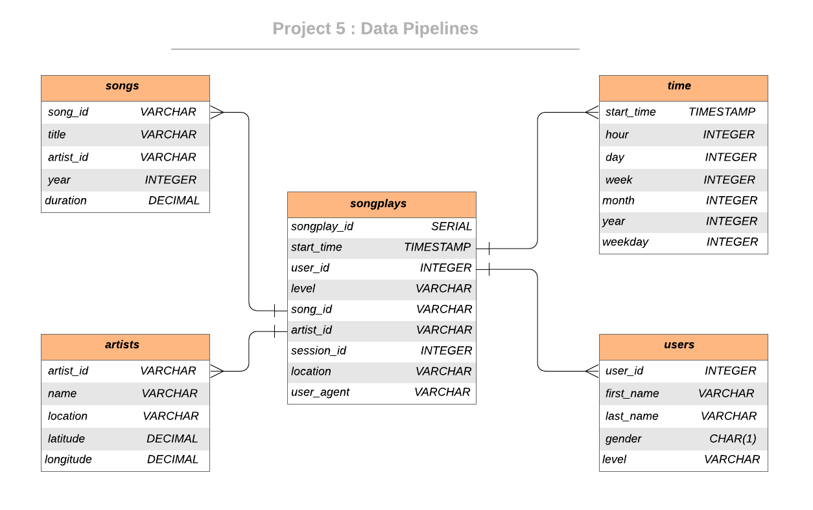

 
 <h3 align="center">Data Pipelines with Airflow</h3>
 

  Udacity Nanodegree - Project 5
   

## About The Project

### Project Description

As a data engineer, you need to to build data pipeline which using Apache Airflow to define and perform staging, filling the data warehouse. 
Finally, in final step you need to make a checking script to make sure the process is worked properly..

### Built With

### Dataset

#### Song Dataset

Sample Record :

`
{"num_songs": 1, "artist_id": "ARJIE2Y1187B994AB7", "artist_latitude": null, "artist_longitude": null, "artist_location": "", "artist_name": "Line Renaud", "song_id": "SOUPIRU12A6D4FA1E1", "title": "Der Kleine Dompfaff", "duration": 152.92036, "year": 0}
`

#### Log Dataset

`
{"artist": null, "auth": "Logged In", "firstName": "Walter", "gender": "M", "itemInSession": 0, "lastName": "Frye", "length": null, "level": "free", "location": "San Francisco-Oakland-Hayward, CA", "method": "GET","page": "Home", "registration": 1540919166796.0, "sessionId": 38, "song": null, "status": 200, "ts": 1541105830796, "userAgent": "\"Mozilla\/5.0 (Macintosh; Intel Mac OS X 10_9_4) AppleWebKit\/537.36 (KHTML, like Gecko) Chrome\/36.0.1985.143 Safari\/537.36\"", "userId": "39"}
`

## Database Schema Design

### Data Model ERD

The data stored in S3 buckets will be processed and insert fact and dimensional tables back to Redshift, whole process will be implemented by using Apache Airflow.

## Apache Airflow Orchestration 

### DAG Structure

The DAGs requirements :

- not have dependencies on past runs
- schedule interval set to hourly
- the task are retried 3 times if failure
- every 5 minutes for retrying
- turn off catchup
- not sent email on retry

### Operators

-  **Stage Operator:** The stage operator loads any JSON formatted files from S3 to Amazon Redshift.

- **Fact and Dimension Operators:** The dimension and fact operators make use of the SQL helper class to run data transformations. 
- **Data Quality Operator:** The data quality operator is used to run checks on the data itself.

## Project structure

Files in this repository:

|   File / Folder   |                         Description                          |
| :---------------: | :----------------------------------------------------------: |
|       dags        | DAGs and SubDAGS are stored |
|  plugins  |        Contains a SQL helper and custom operator         |
| create_tables.sql | SQL commands to create the Redshift tables |
|      README       |                         Readme                         |

## Getting Started

### How to run
1. Set up Apache Airflow 
2. Navigate to project folder
3. Set up `AWS Connection` and `Redshift Connection` to Airflow
4. Turn the DAG execution ON in Apache Airflow
5. Detailed insights about the operation in Web UI

