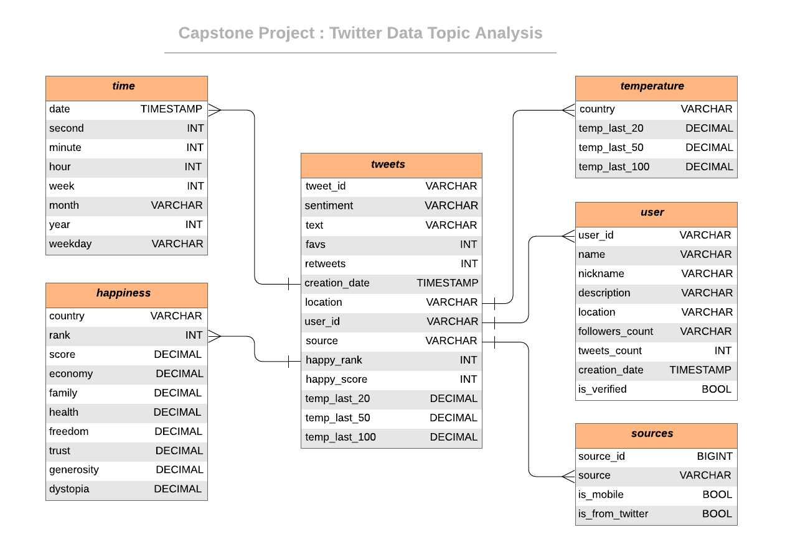
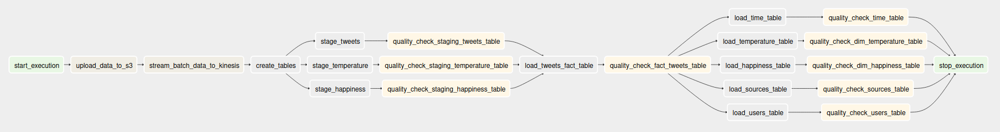

 
 <h3 align="center">Twitter Data  Analysis</h3>
 

 Udacity Nanodegree - Capstone Project
  
 
## About The Project

The project need to collect the tweet data and combine  with world happiness index data and earth surface temperature data to deliver insights. After all, it will use AWS warehouse  which allows us to explore various domains.

### Project Description

#### Define the Data Model

The Star Database Schema (Fact and Dimension Schema) is used for data modeling in this ETL pipeline. 

|        Table        |                         Description                          |
| :-----------------: | :----------------------------------------------------------: |
|   staging_tweets    |                 tweet data staging table          |
|  staging_happiness  |         world happiness index data staging table         |
| staging_temperature |              temperature data staging table              |
|        users        | staging_tweets dimension table|
|      happiness      | happiness data  dimension table |
|     temperature     | temperature data  dimension table |
|       tweets        | fact table containing tweet information, happiness index and temperature from all **three staging tables** |

**DAG Operations**

The Airflow DAG steps:

1. schedule execution
2. AWS Redshift cluster creation
3. AWS S3 static dataset uploading
4. ingest AWS S3 streaming
5. AWS Redshift creation
6. AWS Redshift staging data
7. quality check on the staging tables
8. facts table transforming and loading
9. quality check on the facts tables
10. dimensional table transforming and loading
11. quality check on the dimensional tables
12. destroy the clusters and end execution

##### Data quality checks

* Integrity checks
* Source/Count checks

  
## Apache Airflow Orchestration 

### DAG Structure

The DAG parameters are set according to the following :

- not have dependencies on past runs
- schedule daily interval
- retry 3 times in failure
- retry tasks every 5 minutes
- turned off catchup
- not sent email on retry

## Project structure

Files in this repository:

|  File / Folder   |                         Description                          |
| :--------------: | :----------------------------------------------------------: |
|     airflow      | Folder at the root of the project, where DAGs and associated python scripts are stored |
|     datasets     | Folder at the root of the project, where static datasets are stored |
|      images      |  Folder at the root of the project, where images are stored  |
|       sql        | Folder at the root of the project, where SQL commands are stored |
|    config.cfg    |                  Sample configuration file                   |
| requirements.txt |             Python environment requirements file             |
|   DATADICT.md    | Data Dictionary file with explanation of attributes of tables |
|    README.md     |                         Readme file                          |

## Getting Started

### How to run

1. Set up Apache Airflow

2. Navigate to project folder

3. Install requirements 

4. Edit and fill in `config.cfg` 

5. Download the static datasets 

6. Trigger Airflow DAG ON

7. Verify the DAG execution by executing analytics tasks.
